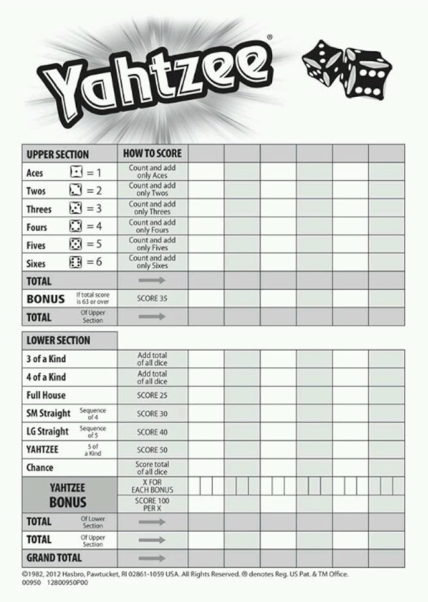
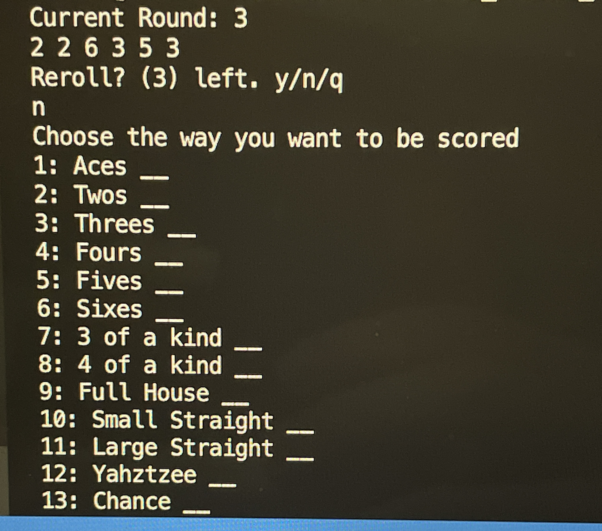
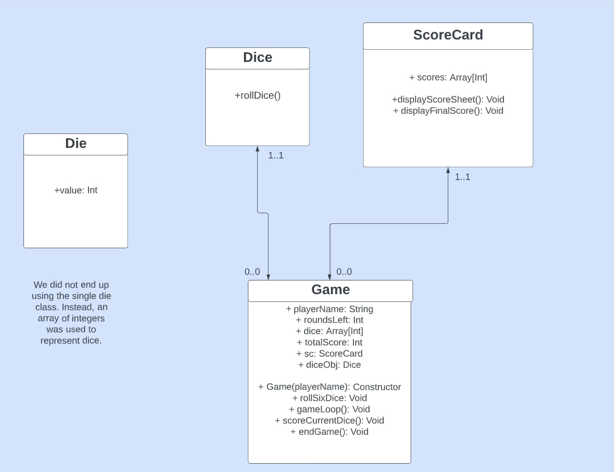
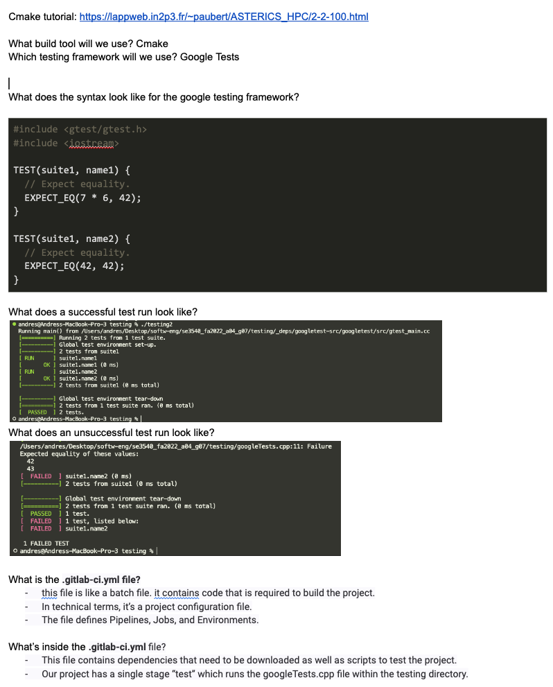
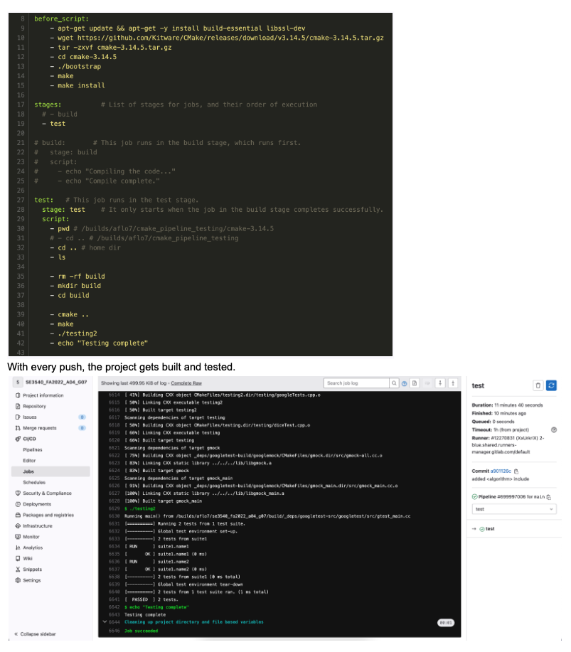

<h1>Yahtzee Game</h1>
<h2>Made By Andres Flores</h2>

### Technologies Used:
-   C++
-   Google Tests
-   VS Code

<h3>Gameplay</h3>

- Rounds: 13

- At the start of each round, user rolls 6 dice at the same time. From here, the user needs to choose one of the above 13 categories to score on their current 6 dice,  or reroll all 6 dice. 

- Player can reroll up to 3 times per round. Player has to fill up all 13 categories by the end of the game.

- At the end of the 13 rounds, the users final score will be displayed. The final score is calculated by adding all of the 13 category scores.

<h2>How to run the program (make sure you are in the game directory)</h2>

1. g++ game.cpp -o game --std=c++17
2. ./game

<h2>UML Diagram</h2>

For CI/CD and testing info, check the screenshots readme1.png and readme2.png

<h2>CI/CD Pipeline Information</h2>

